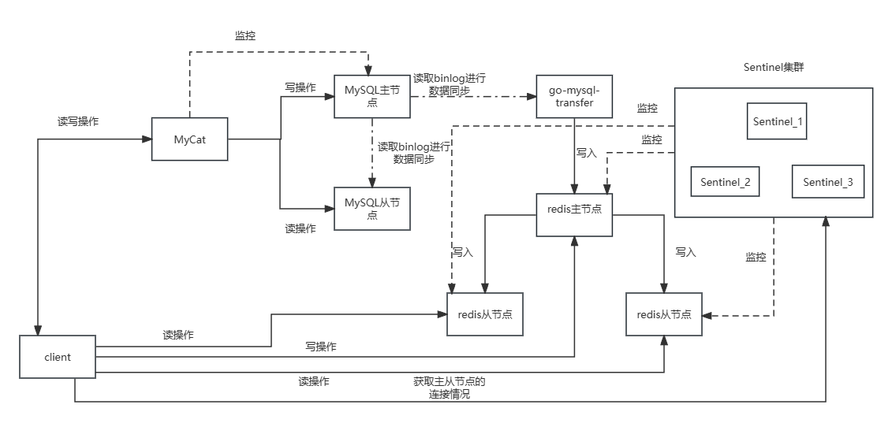
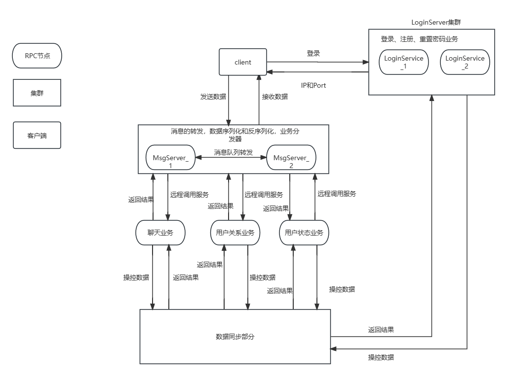
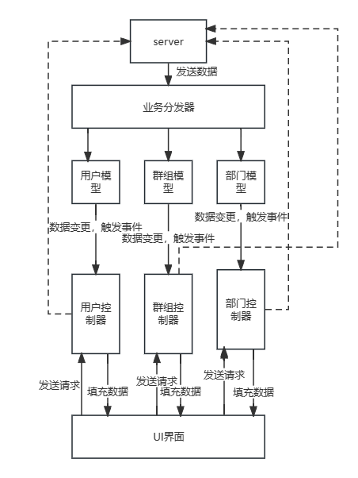

# 即时通讯项目IMCPP

# 简介

该项目是一个基于自研小型RPC框架的即时通讯项目，支持登录，注册，添加好友，好友聊天，创建加入群组，群聊，部门聊天，管理聊天记录，离线消息等功能。

## 项目环境

### 服务器

- Linux version 3.10.0 (CentOS 7.9 64位)
- gcc version 7.3.1
- g++ version 7.3.1
- cmake version 3.26.4
- boost version 1.75.0
- mysql version 5.7.42
- redis version 7.0.4
- nginx version 1.12.2
- go-mysql-transfer 1.0.5

### 客户端

- Qt version 5.15.2
- MinGW 8.1.0 64-bit

## 编译

```shell
# 编译服务器
mkdir build
cd ./build
cmake ..
make 

# 编译客户端使用Qt Creator直接编译运行即可
```

## 启动服务器


## 项目特点

- 自研RPC框架，基于Muduo网络库，Protocol Buffers和Zookeeper进行实现，可使用Nginx进行反向代理和均衡负载，提高服务节点的并发量。
- 使用Muduo网络库作为项目的网络层核心模块，提供高并发网络I/O服务，解耦网络和业务模块代码。
- 使用Json序列化和反序列化消息作为客户端与服务端的私有通信协议。
- 使用MySQL数据库作为项目数据的存储，Redis数据库作为项目数据的缓存，go-mysql-transfer作为数据同步工具，实现项目的缓存系统。MySQL和Redis均采用了主从复制，读写分离和故障转移的方案，提高数据的读取速度，并发能力和容灾能力。使用go-mysql-transfer实现数据一致性和数据同步。
- 使用Redis的发布-订阅功能，实现跨服务器的消息队列。
- 客户端采用Qt框架制作GUI界面，采用MVC模式进行设计，使界面与业务逻辑分离，增加系统的可维护性和拓展性。

## 项目架构分析

### 数据同步架构



### 服务器架构



### 客户端架构


